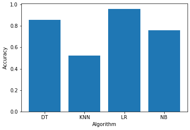

# CSE422: Artificial Intelligence

Mobile phones are available in a wide range of costs, features such as internal memory or battery power, and other criteria. A key component of consumer strategy is the estimate and forecast of prices. Our study focuses on training machine learning models using readily accessible information on the numerous features and price ranges of mobile phones in the market to make the prices of newer products determinable. The models were trained on the [Mobile Price Classification](https://www.kaggle.com/datasets/iabhishekofficial/mobile-price-classification) dataset provided on *Kaggle* by *Abhishek Sharma*, a  *Maropost* Data Scientist.

The machine learning models used are provided below:
* K-Nearest Neighbor
* Logistic Regression
* Naive Bayes
* Decision Tree

The results of the study are illustrated as follows: 

To learn more read up on it in our report: [Lab Report on Mobile Price Prediction](https://github.com/20101301-Alina-Hasan/Mobile-Price-Prediction-AI/blob/fdf4f28eb345d65392714d30c1b687eac3ea8ca4/Lab%20Report_%20Mobile%20Price%20Prediction.pdf)
